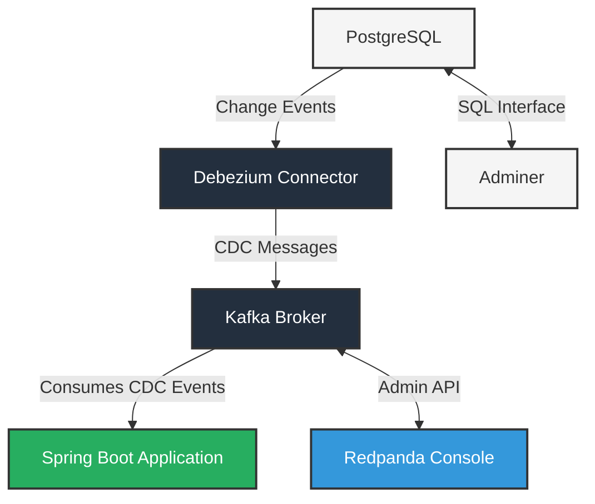

# Kafka CDC Setup with Debezium and PostgreSQL

This project sets up a Change Data Capture (CDC) pipeline using Debezium, PostgreSQL, Apache Kafka, and Redpanda Console. The setup enables real-time tracking and processing of database changes.

## Architecture

The setup consists of the following components:

- **PostgreSQL**: Source database with logical replication enabled
- **Kafka**: Message broker using Confluent's Kafka in KRaft mode
- **Kafka Connect**: With Debezium connector for PostgreSQL
- **Redpanda Console**: Web UI for managing and monitoring Kafka
- **Adminer**: Web-based database client for PostgreSQL



## Prerequisites

Before you begin, make sure you have the following installed:

- Docker and Docker Compose (v2.x or higher)
- Git (optional, for cloning the repository)
- At least 4GB of free RAM for running all containers

## Project Structure

```
.
├── docker-compose.yml              # Main configuration file for all services
├── register-connector.sh           # Script to register Debezium connector
├── init-db.sh                      # Database initialization script
├── store/                          # Persistent data directory
│   ├── kafka/                      # Kafka data
│   ├── kafka-connect/              # Kafka Connect plugins
│   └── postgres/                   # PostgreSQL data
└── README.md                       # This documentation file
```

## Setup Instructions

### 1. Prepare the Environment

Create the necessary directory structure:

```bash
mkdir -p ./store/postgres ./store/kafka ./store/kafka-connect
```

### 2. Make the Scripts Executable

```bash
chmod +x register-connector.sh init-db.sh
```

### 3. Start the Services

```bash
docker-compose up -d
```

### 4. Verify the Setup

Wait for all services to start (this may take a minute or two), then:

1. Verify Kafka is running:
   ```bash
   docker logs KRaft | grep "Started NetworkServer"
   ```

2. Verify PostgreSQL is running:
   ```bash
   docker exec -it postgres-cdc psql -U postgres -c "SELECT version();"
   ```

3. Verify PostgreSQL WAL level is set to logical:
   ```bash
   docker exec -it postgres-cdc psql -U postgres -c "SHOW wal_level;"
   ```

4. Check Kafka Connect status:
   ```bash
   curl http://localhost:8083/connectors/debezium-connector/status
   ```

### 5. Access the Web Interfaces

- **Redpanda Console**: http://localhost:8082
  - Browse Kafka topics
  - View messages in the CDC topic
  - Monitor connectors

- **Adminer**: http://localhost:8081
  - Log in with:
    - System: PostgreSQL
    - Server: postgres
    - Username: postgres
    - Password: password
    - Database: mydb

## Testing CDC

1. Insert a new row into the `users` table:
   ```bash
   docker exec -it postgres-cdc psql -U postgres -d mydb -c "INSERT INTO users (name, email) VALUES ('Alice Williams', 'alice@example.com');"
   ```

2. Update an existing row:
   ```bash
   docker exec -it postgres-cdc psql -U postgres -d mydb -c "UPDATE users SET name = 'Alice Cooper' WHERE email = 'alice@example.com';"
   ```

3. Delete a row:
   ```bash
   docker exec -it postgres-cdc psql -U postgres -d mydb -c "DELETE FROM users WHERE email = 'alice@example.com';"
   ```

4. View the CDC events in the Redpanda Console:
   - Go to http://localhost:8082
   - Navigate to the Topics section
   - Select the `cdc-events.postgres-server.public.users` topic
   - You should see the create, update, and delete events

## Spring Boot Configuration Example

For a Spring Boot application to consume the CDC events, create an `application.yaml` with the following configuration:

```yaml
server:
  port: 8080
  servlet:
    context-path: /api
  shutdown: graceful

spring:
  application:
    name: cdc-consumer-service
  
  # Datasource configuration with HikariCP
  datasource:
    url: jdbc:postgresql://localhost:5432/mydb
    username: postgres
    password: password
    driver-class-name: org.postgresql.Driver
    hikari:
      connection-timeout: 30000
      maximum-pool-size: 10
      minimum-idle: 5
      idle-timeout: 600000
      max-lifetime: 1800000
      auto-commit: true
      pool-name: HikariCP-Pool

  # JPA/Hibernate properties
  jpa:
    hibernate:
      ddl-auto: update
    show-sql: true
    properties:
      hibernate:
        format_sql: true
        dialect: org.hibernate.dialect.PostgreSQLDialect
    open-in-view: false

  # Kafka Consumer properties
  kafka:
    consumer:
      bootstrap-servers: localhost:19092
      group-id: ${spring.application.name}
      auto-offset-reset: earliest
      key-deserializer: org.apache.kafka.common.serialization.StringDeserializer
      value-deserializer: org.springframework.kafka.support.serializer.JsonDeserializer
      properties:
        spring.json.trusted.packages: "*"
        spring.json.use.type.headers: false
        isolation.level: read_committed
      enable-auto-commit: false
    listener:
      ack-mode: MANUAL_IMMEDIATE
      concurrency: 1
      missing-topics-fatal: false

# Application specific properties
app:
  kafka:
    topics:
      user-events: cdc-events.postgres-server.public.users
```

## Troubleshooting

### Kafka Connect Issues

If the connector fails to start:

```bash
# Check the connector status
curl http://localhost:8083/connectors/debezium-connector/status

# View Kafka Connect logs
docker logs kafka-connect
```

### PostgreSQL Issues

If PostgreSQL doesn't have logical replication enabled:

```bash
# Check WAL level
docker exec -it postgres-cdc psql -U postgres -c "SHOW wal_level;"
```

### Restarting Services

To restart the entire setup:

```bash
docker-compose down
docker-compose up -d
```

To restart a specific service:

```bash
docker-compose restart [service-name]
```

## Stopping the Services

To stop all services:

```bash
docker-compose down
```

To completely clean up (including volumes):

```bash
docker-compose down -v
```

## References

- [Debezium Documentation](https://debezium.io/documentation/reference/stable/connectors/postgresql.html)
- [Confluent Kafka Documentation](https://docs.confluent.io/platform/current/installation/docker/config-reference.html)
- [PostgreSQL Logical Replication](https://www.postgresql.org/docs/current/logical-replication.html)
- [Redpanda Console Documentation](https://docs.redpanda.com/docs/console/)
